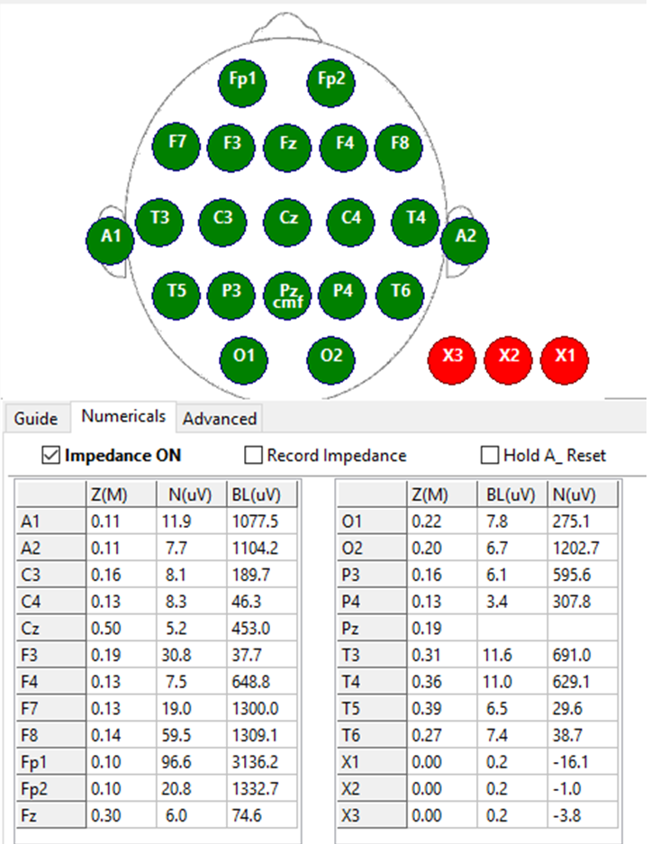
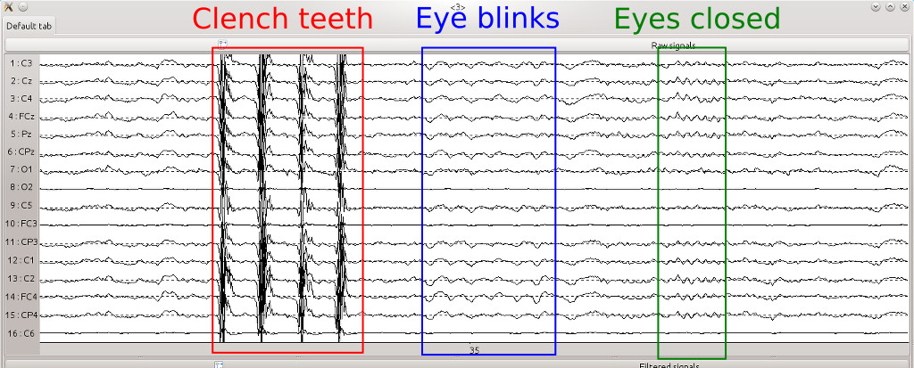

### Our Primary Headset

The EEG Headset that we primarily use is the DSI-7, which is a headset made by a SD based company named Wearable Sensing. This headset is a dry EEG Headset, meaning that you don’t use any gel or solution to help conduct the electrical signal from the neurons to the electrodes.

This headset has 7 channels:
3 frontal: Fpz, F3 and F4
2 center: C3 and C4
3 Posterior: Pz, P3, and P4

### Step 1: Setup the EEG system

This step is pretty straightforward; you put the EEG headset onto the participant, and connect the headset to a recording software
For the DSI-7, this software would be DSI Streamer. It connects wirelessly via bluetooth, and you can consult the manual for more information about it

1. First, before you put on the headset, make sure the participant is comfortable, knows what they are going to do, and is able to stay seated and fairly still for the length of the experiment; Even with dry EEG headsets, it can take a while to put the headset on and go through this whole procedure
2. Put on the headset carefully on the participant. The specific steps to putting on the headset will depend on what type of headset you are using, so consult the user manual for a more in-depth tutorial on this
    - While putting on the headset, make sure the participant is comfortable and not being hurt by the headset
3. Center the headset, by measuring the distance of the headset to different parts of the skull and adjusting it accordingly
    - The front electrode/front of the headset should be measured to the nasion (insert picture here)
    - The back of the headset should be measured to the inion (insert picture here)
    - We don’t have a specific procedure for centering it laterally, but you can do it by lining up the middle electrodes with the nasion and inion
4. Connect the headset to a recording device or software

### Step 2: Check for impedance

Before we actually collect data, we want to make sure that the electrodes on the headset aren't blocked by impedance (opposition of electrical flow). This impedance can be caused by things like hair under the electrode, 
sweat, the electrode not making enough skin contact, etc.

Usually, to check impedance we use an impedance checker built into the recording software we use (DSI Streamer, meant for EEG Headsets from Wearable Sensing). It looks like this:  

Here we can see a visual of the headset on a person's head, and the electrodes are colored green. This means that there is low impedance and the signal for each electrode is good. If any of them were colored yellow ("pretty meh" signal) or red(bad signal) then each electrode would have to be adjusted until it becomes green.

This process of checking impedance may differ based on what headset and recording software you use, but this is a required step to ensure the data you record is clean 

### Step 3: Check Artifacts

Next, we will check to see some common Artifacts show up in the EEG stream. The artifacts that we usually check are
eye blinks, jaw clenches, and closed eyes/rest state. 

This is what they will look like on your stream if it is recording properly:

### Step 4: Ready to Collect Data

Now you're done with setting up and calibrating your EEG headset and stream,
and you can collect data for your project! Before you jump into it, here are some
things to consider:
- make sure your participant is comfortable
- For very long recording sessions (ex: hour long session), have your participant take a break in between and remove the headset
so they can rest their eyes, go to the bathroom, etc. ; it's best to spend the extra time to put the headset on again
and repeat the above steps so you don't risk them getting too tired and not focusing as well on the task
- Try to ease any participant discomfort as much as possible without removing the headset, but if they 
really need to take it off and take a break or record later (ex: feeling sick and is really uncomfortable)
then schedule another time to record with them
- make sure your recording environment is free of distractions (quiet environment, nothing around them that hurts
their focus, etc.)

