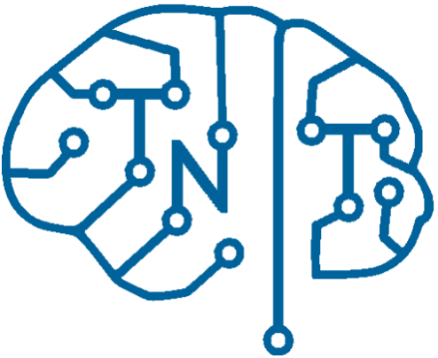

<header>
    

      
      <h1 style="text-align: center;">
        <a href="/TNT-Education-Site">
        Triton Neurotech
        </a>
      </h1>
    

  <nav style="background-color: #34a1eb; padding: 10px; display: flex;">
    <ul style="list-style-type: none; margin: 0; padding: 0; display: flex; width: 100%; justify-content: space-between;">
      <li style="flex: 1;">
        <a href="/TNT-Education-Site/hardware-home" style="color: white; text-decoration: none; padding: 14px 0; display: block; text-align: center;">Hardware</a>
      </li>
      <li style="flex: 1;">
        <a href="/TNT-Education-Site/software-home" style="color: white; text-decoration: none; padding: 14px 0; display: block; text-align: center;">Software</a>
      </li>
      <li style="flex: 1;">
        <a href="/TNT-Education-Site/machine-learning-home" style="color: white; text-decoration: none; padding: 14px 0; display: block; text-align: center;">Machine Learning</a>
      </li>
      <li style="flex: 1;">
        <a href="/TNT-Education-Site/data-collection-home" style="color: white; text-decoration: none; padding: 14px 0; display: block; text-align: center;">Data Collection</a>
      </li>
      <li style="flex: 1;">
        <a href="/TNT-Education-Site/neuroscience-home" style="color: white; text-decoration: none; padding: 14px 0; display: block; text-align: center;">Neuroscience</a>
      </li>
    </ul>
  </nav>

</header>

---

## About This Site
Welcome to Triton Neurotech's new site for educational content! This site is mainly focused on educating the members of the club about the many facets of neurotechnology and providing practical lessons and tutorials for making neurotechnology devices and applications. 

## What is Neurotechnology?
Neurotechnology bridges the gap between neuroscience and modern technology. It involves both hardware and software systems designed to understand, repair, or augment the nervous system.

## How to Navigate the Site
Our educational content is centered around 5 main topics that we feel are most relevant to the projects that we do in the club:
- Hardware: Recording Devices we use, such as EEG Headsets, as well as other pieces or hardware like Arduinos
- Software: The basics of the coding packages and software tools (Github, Anaconda, etc.) that we utilize
- Neuroscience: Essential concepts about neurons, event-related potentials, neural signals, and more
- Data Collection: detailed guides and tutorials on recording and processing neural signal data
- Machine Learning: The basics of machine learning, ways to use it to analyze neural signals, and unique models used in neurotechnology
